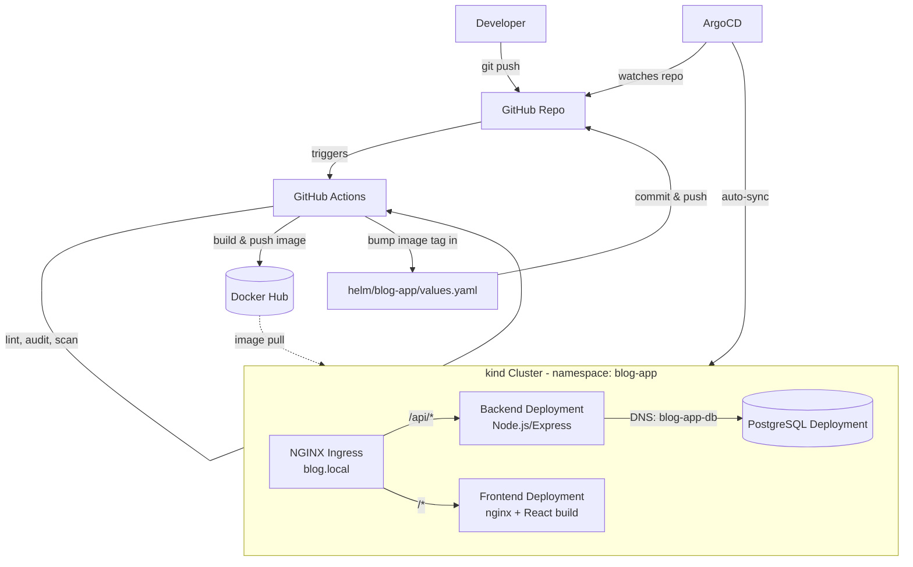

# Blog App — Kubernetes + Helm + ArgoCD GitOps

A minimal 3-tier blog application (React frontend, Node.js/Express backend,
PostgreSQL) deployed to a local Kubernetes cluster using Helm for
templating and ArgoCD for GitOps-based continuous delivery.

Built as a DevOps infrastructure challenge: the focus is the deployment
pipeline and cluster architecture, not the application itself. Supports
creating, updating, and deleting posts and comments.

---

## Architecture



**Flow summary:**
1. Code is pushed to GitHub.
2. GitHub Actions lints, audits dependencies, builds Docker images, pushes
   them to Docker Hub, scans the images and the Helm chart, then bumps the
   image tag in `helm/blog-app/values.yaml` and commits that back to the repo.
3. ArgoCD, running inside the cluster, watches this repo. It detects the
   `values.yaml` change and automatically syncs the Helm chart into the
   cluster — this is the actual "deploy" step, and it's why GitHub Actions
   never runs `kubectl` or `helm` directly.
4. NGINX Ingress is the single entrypoint (`blog.local`), routing `/api/*`
   to the backend and everything else to the frontend.
5. The backend reaches PostgreSQL purely via Kubernetes DNS
   (`blog-app-db`), with no hardcoded IPs.

---

## Tech stack

| Layer             | Choice                                       |
|-------------------|----------------------------------------------|
| Frontend          | React (Vite), served via nginx in prod       |
| Backend           | Node.js / Express                            |
| Database          | PostgreSQL 16                                |
| Containerization  | Docker (multi-stage builds)                  |
| Orchestration     | Kubernetes via `kind` (local, multi-node)    |
| Packaging         | Helm chart (single chart, environment-agnostic) |
| CI                | GitHub Actions (lint, audit, build, scan)    |
| CD                | ArgoCD (GitOps, auto-sync + self-heal)       |
| Ingress           | ingress-nginx, host-based routing            |
| Registry          | Docker Hub                                   |

---

## Repository structure

```
.
├── backend/                  # Node.js/Express API
├── frontend/                 # React app + nginx.conf
├── helm/
│   └── blog-app/
│       ├── Chart.yaml
│       ├── values.yaml       # single source of config: images, resources, db, ingress
│       └── templates/        # namespace, secret, db, backend, frontend, ingress, netpol
├── argocd/
│   └── application.yaml      # ArgoCD Application - watches helm/blog-app
├── kind-config.yaml           # local cluster: ingress-ready node + port mappings
├── .github/workflows/ci-cd.yaml
```

---
